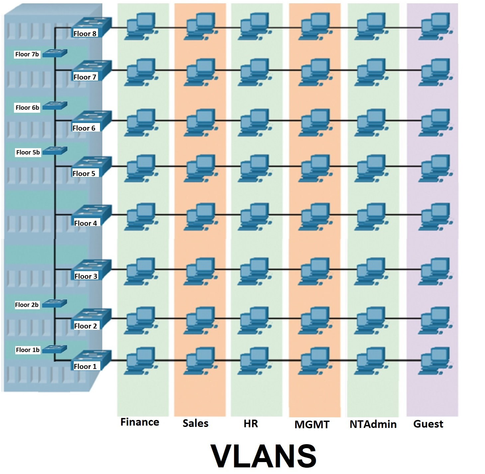

# Cisco Networking
This repository showcases my journey through Cisco networking courses and labs, where I applied concepts hands-on using real hardware and simulators like Cisco Packet Tracer. My skills span from foundational switch configuration to advanced enterprise network planning, security hardening, and Layer 3 upgrades.
## Network Courses Completed
- CIS 26A – Introduction to Networks (RCC)
- CIS 26B – Switching, Routing, and Wireless Essentials (RCC)
- IST 4210 – Advanced Networking and Security (CSUSB)
## Tools and Equipment
### Software Used:
- Cisco IOS (CLI configuration)
- Cisco Packet Tracer
- PuTTY (terminal emulator)
- Tftpd64 (for IOS upgrades)
### Hardware Used:
- Cisco 3750-48PS switch
- Linksys WRT54GL router
- HP network printer
- Console and Ethernet cables
## Core Concepts Demonstrated
### Networking Fundamentals
- IP addressing and subnetting (VLSM)
- VLAN segmentation
- Static routing and route summarization
- DHCP and NAT configuration
- Port security and MAC filtering
- Access control lists (ACLs)
- Point-to-point connections
- Network troubleshooting (`ping`, `traceroute`, etc.)
### Switch Configuration Tasks
- Hostname and banner setup
- Password encryption and login security
- VTY access and SSH configuration
- Disabled unnecessary services (e.g., DNS lookup)
- Logging synchronization
- Inter-VLAN routing via Layer 3 upgrades
## Real Hardware Lab Activities
### Basic Switch Setup
- Assigned hostnames and IP addresses
- Configured password-protected access (console, VTY, and privileged exec)
- Enabled SSH and secured remote access
- Applied banners and password encryption
### Security Measures
- Created and applied standard and extended ACLs
- Set up management VLANs
- Restricted services by IP and protocol using ACLs
## Enterprise Network Lab (IST 4210)
We designed a full-scale enterprise networking project in groups, simulating a multi-floor building with segmented VLANs, routed traffic, bridged wireless access points, ACLs for security, and Layer 3 functionality.
**Diagram of the Topology:**  

### Features Implemented:
- VLANs per floor and department
- Trunking between switches and routers
- ACLs for role-based access (e.g., only HR can print, only admins can SSH)
- DHCP per subnet
- Wireless AP bridging using Linksys WRT54GLs
- Layer 2 to Layer 3 IOS upgrade on a switch to enable inter-VLAN routing
- Connected an HP network printer to the switch and printed a test page to confirm connectivity
## Cisco Packet Tracer Assignments
Hands-on Packet Tracer labs helped solidify my understanding of both basic and advanced concepts:
1. Designed a network topology that mirrors the classroom’s physical setup
2. Created complete network addressing tables
3. Assigned IPs and subnet masks using VLSM
4. Configured VLANs and trunk ports
5. Applied port security and tested violations
6. Configured DHCP and NAT
7. Built and tested ACLs for service restrictions
8. Practiced troubleshooting using `ping`, `traceroute`, and `show` commands
9. Simulated and verified inter-VLAN routing
## Attachments in This Repo
This repository includes some files showing proof of what I was able to do with my group for this project:
- `swfloor6-config` – The switch configuration for Floor 6, containing VLAN definitions, trunk configurations, ACLs, SSH settings, and more.
- `tftp download` – A screenshot showing the download of the running-config file from the switch to a TFTP server I was hosting on my laptop.
- `BuildingDiagramVLANS.jpg` – A visual of the full building diagram used for the group project. Each group was assigned a floor; we were responsible for Floor 6.
- `Addressing Table (Group Project).pdf` – Our floor’s addressing table, including assigned subnets, device IPs, and DHCP exclusions.
